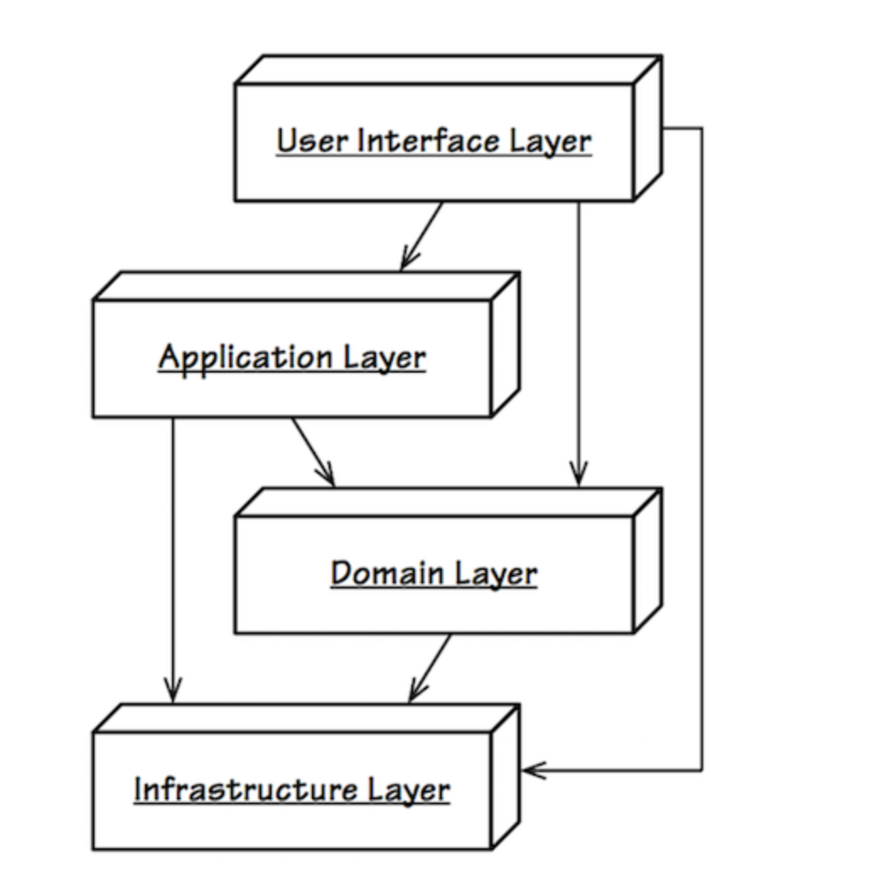

### 模块划分
1. thanos-portal：门户模块
2. thanos-spm：备件管理模块
3. thanos-common：放置公有的模型、工具类、异常类等
4. thanos-deploy: 无任何业务逻辑，仅仅用作部署

### 模块分层架构

### 技术选型

1. spring-data-mongo：提供了大量的模版的方法，大大提高开发效率
2. swagger: 用来约定api文档
